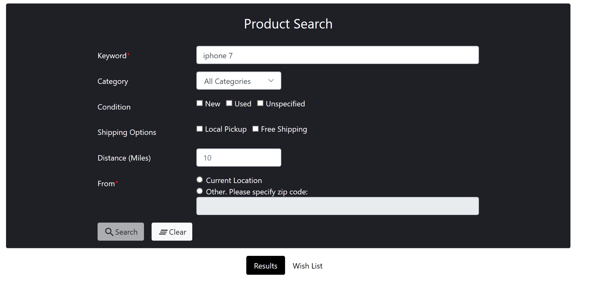
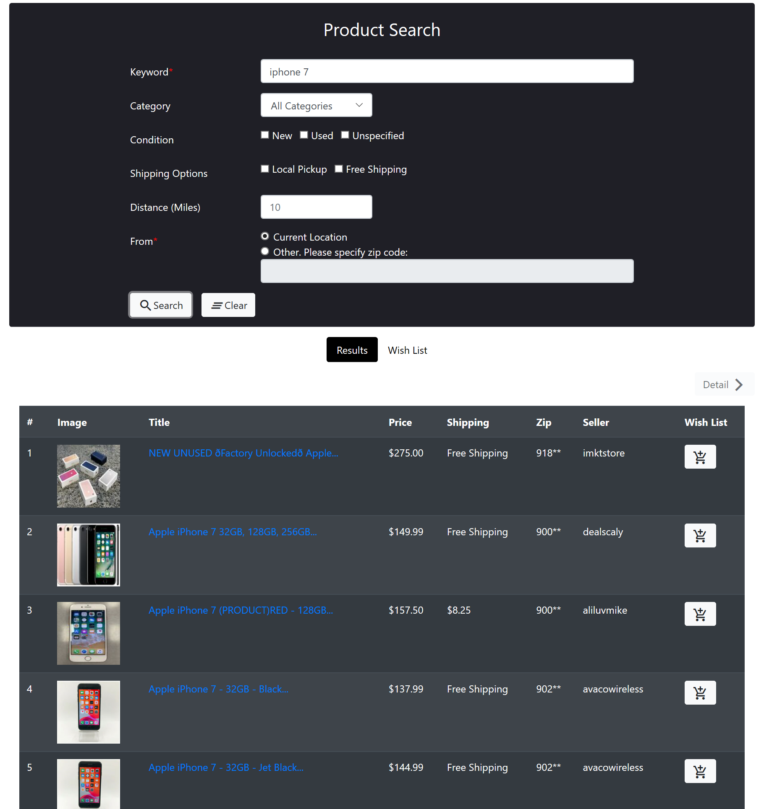
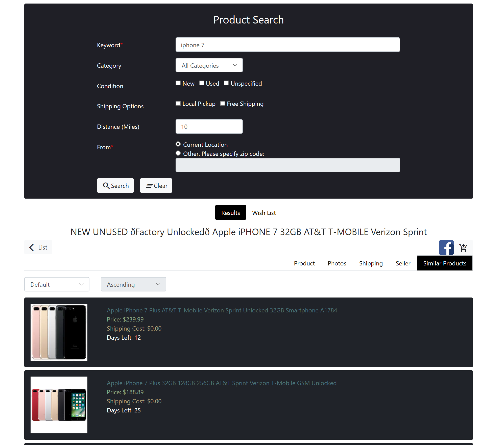
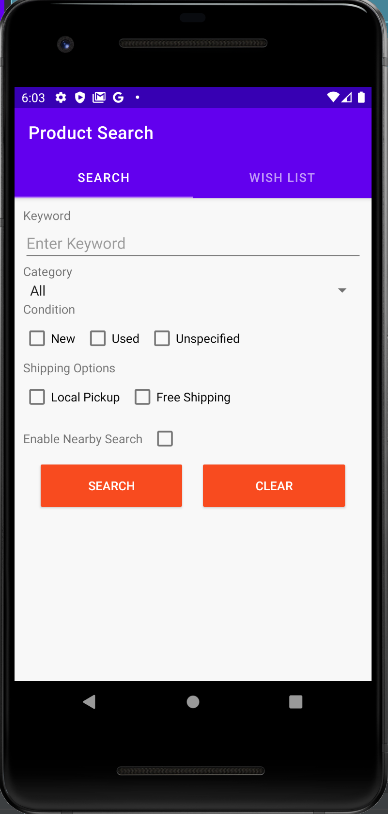

# Information Integration Platform
1. Collect information of items from ebay and google
2. Support Web/Android

## Project Folder
1. front - web application based on Angular 7
2. backend - node.js application based on Express
3. android - android application

## Preview
### index page

### result page

### detail page

### android

